# CSC 59866 - Senior Design II   American Dream

# Team members
| Name | Role | GitHub link |
| - | - | - |
| Martin Lahoumh | Leader | https://github.com/MartinLahoumh |
| Brandon Tjandra | Techsmith | https://github.com/btjandra15 |
| Miguel Luna | Systems Savvy | https://github.com/luna-miguel |
| Jiazhou Zhang | Quality Assurance | https://github.com/Jiazhou-Zhang |

# Project idea

The goal of this project is to create a web application that takes an image supplied by the user that contains text of a specified language, extracts it, and translates it to a user's preferred language (i.e. French, Spanish, Chinese, etc.) 
* The machine learning aspect of this project is detecting where in an image is text located, to which that text is extracted.
* The extracted text will be translated via a translation API, to which it would return that translation to the user on top of the supplied image.

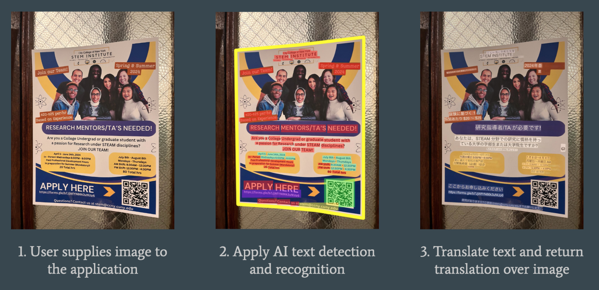

# Previous work

This section covers research and idea formulation from the previous semester of this project. 

  
### Research

| Article | Summary | How it helps us |
| - | - | - |
| [How Mask R-CNN Works?](https://developers.arcgis.com/python/guide/how-maskrcnn-works/) | Mask R-CNN is an R-CNN (A region-based convolutional neural network) model for instance segmentation. Object instance segmentation integrates the task of object detection (detect an object along a specified bounding pox) and the task of segmentation, which classifies each pixel into a pre-defined category and creates a mask for parts of the given image to highlight specific features of it. | Mask R-CNN is the machine learning model we are interested in using for this project to find and detect text in images. |
| [Translating the text of images](https://www.alphatrad.com/news/how-translate-text-from-image#:~:text=Google%20Translate%3A%20uses%20image%20segmentation,the%20language%20of%20your%20choice.) | Discusses the way photo translation works on most existing software. For example, Google Translate uses image segmentation to separate the text from the image in a photo. It splits the image into different segments and analyzes it part by part. In analysis, it applies an OCR to convert the photo before translating. OCR extracts text from an image and automatically translates that text. It is a popular tool used in Google Translates, Microsoft Translator, Text Fairy, Scan & Translate (Apple), and Prizmo. | This is the technology we will be attempting to use in order to translate text in our project. |
|[Text Detection, Recognition and Translation](https://medium.com/analytics-vidhya/scene-text-detection-recognition-and-translation-ad20c31e869e) | Provides a general overview of how machine learning can be used to detect text in images and videos in real time. It discusses challenges in the process, examples of datasets and models, and analysis of accuracy. | This article provides datasets that may be helpful for text that is slanted and not perfectly readable. It also gives off good recomendations for models used for detection and recognition. |

### Potential methods

| Method | Summary |
| - | - |
| [OpenCV](https://theclassytim.medium.com/using-image-processing-to-detect-text-8be34c677c11) | Use Otsu's threshold method if the focus is to detect words, or an adaptive threshold for individual characters. While creating contours, setting the second argument in 'findContours()' to 'RETR_CCOMP' ignores contours with a parent, in cases where letters with loops are recognized as multiple. Use a convoluted neural network to on each bounding box and determine if the letter in the box resembles an actual letter, in case multiple letters are grouped into one.|
| [Mask-RCNN Text Detection](https://github.com/cuppersd/MASKRCNN-TEXT-DETECTION) | This model detects words as a whole with a CNN, to which is then extracts each individual character from that text. Segmentation masks are used to find the appropriate bounding boxes for texts. |
|[Single Shot MultiBox Detector](https://arxiv.org/abs/1512.02325) | Creates a bounding box for each word that is detected. Networks generates scores for the presence of each object category, and adjusts the box as necessary. Combines predictions from multiple feature maps to handle objects of different sizes. |
| [Using the Translation API with Python](https://codelabs.developers.google.com/codelabs/cloud-translation-python3#0) | Information regarding access, setup, and usage of Google's Cloud Translation API. With an active Google Cloud shell and environment, a Python program can list all available lanugages Google Translate offers, query translations, and detect languages. |

### Existing projects

| Name | Description | Date published | Takeaways for our project |
| - | - | - | - |
| [Deep learning-based mobile augmented reality for task assistance using 3D spatial mapping and snapshot-based RGB-D data](https://www.sciencedirect.com/science/article/pii/S0360835220303193#bb0160) | This article proposes a mobile AR utility that identifies objects in the camera and provides or assists users with tasks relating to them, such as how to assemble or disassemble an object or operate machinery wirelessly.  | August 2020 | While AR is not something we will continue to look into unless we have the time provided, a machine learning model being able to recognize specific objects in camera space and provide users with assistive tasks is a core principle of our project as well. |
| [A robust arbitrary text detection system for natural scene images](https://www.sciencedirect.com/science/article/abs/pii/S0957417414004060) | This project proposes a machine learning model that is able to identify any sort of text in a supplied image regardless of any sort of transformation, such as rotation, shear, twist, etc. | December 2014 | This project's main purpose is a fundamental part of our project, that being the ability to extract any and all kinds of text from an image. What sets ours apart is the extra step of translating the text to any other language. |

### Former datasets

| Name | Description | Number of entries | Entry format | Date last updated | 
| - | - | - | - | - |
| [Curve Text (CUTE80)](https://github.com/Yuliang-Liu/Curve-Text-Detector) | The first public curved text dataset, images contain text with complex transformations and obstructions | 80 images, labelled sequentially via XML sheet | `{imageName, polygonPoints}` | 2014 |
| [Total-Text](https://github.com/cs-chan/Total-Text-Dataset?tab=readme-ov-file) | Word-level based English curve text dataset, built on top of CUTE80 | 1,555 images, character masks, and text stored sequentially via .gif files | - | 2022 | 
| [SCUT-CTW1500](https://github.com/Yuliang-Liu/Curve-Text-Detector/tree/master/data) | Text-line based dataset with both English and Chinese instances | 1,500 images, labelled sequentially via .txt file | - | 2020 |

### Feasibility and next steps

With our current level of research, amount of resources including datasets and methods, and current scope for the project, we believe that we will not have much difficulty completing the application within the allotted time in the next semester.    
Should we finish our goal early, the following are additional features we may add to expand the application (in order from least to most difficult):

1. Categorize, identify and translate other signage, including traffic and street signs 
2. Identify and provide interaction with supplemental information in an image, including QR codes, phone numbers, etc. 
3. Add augmented reality (AR) support for the application to identify and translate signs with camera use

# Datasets

This section covers the main datasets we will be making use of for this project. We will be using these datasets for our model's testing and validation.

We chose these datasets because they are the easiest to use and are the most directly relevant for this project's purposes.

| Name | Description | Number of entries | Entry format | Date last updated | 
| - | - | - | - | - |
| [COCO](https://cocodataset.org/#home) | Object detection, segmentation, and captioning dataset | 330K images, >200K labeled | 
 
`info`
   `{"year", "version", "description", "contributor", "url", "date_created"}` 
 
 
`imgs`
   `{"id", "width", "height", "filename", "license", "flickr_url", "coco_url", "date_captured"}` 
 
 
`anns`
  `{"id", "image_id", "category_id", "segmentation", "area", "bbox", "iscrowd"}` 
| 2017 |
| [COCO-Text](https://bgshih.github.io/cocotext/) | Large scale dataset for text detection and recognition in natural images | 63,686 images, 145,859 text instances | 
 
`Instance`
   `imageID, {"id", "image_id", "utf8_string", "bbox", "area", "class", "language", "legibility"}` 
 | 2018 |
| [TextOCR](https://textvqa.org/textocr/) | Text-recognition on arbitrary shaped scene-text present on natural images | 28,134 images and 903,069 annotated words | 
 
`imgs`
 `{"id", "width", "height", "set", "filename"}` 
 
 
`anns`
 ` {"id", "image_id", "bbox", "points", "utf8_string", "area"}` 
 | 2021 |
| [ICDAR-2015](https://www.kaggle.com/datasets/bestofbests9/icdar2015) | Used for a oriented scene multilingual text detection and spotting challenge | 500 images | Each .jpg image in the dataset has a corresponding .txt file containing the text and coordinates. | 2015 |

# Data exploration 

For each dataset, we ran tests to determine information such as:
* The overall size of the datasets
* The number of bounding boxes in each dataset
* Text length information
* Amount of correct English words found in each image

# Data exploration visualization

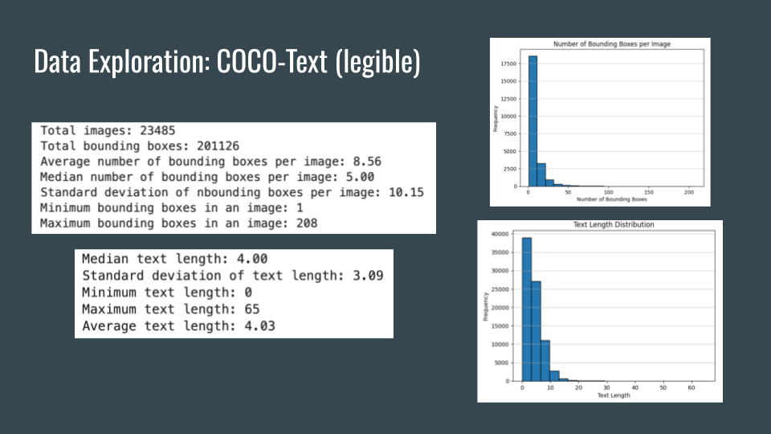
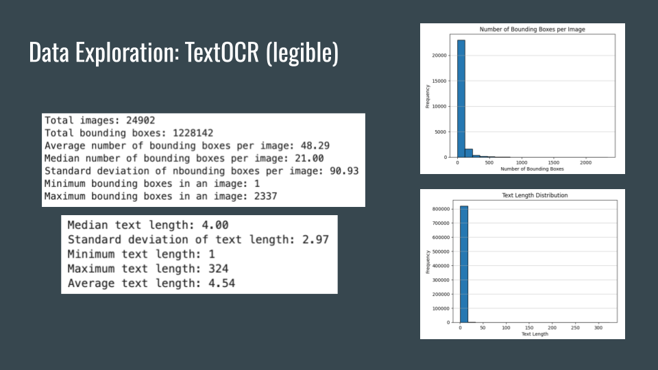
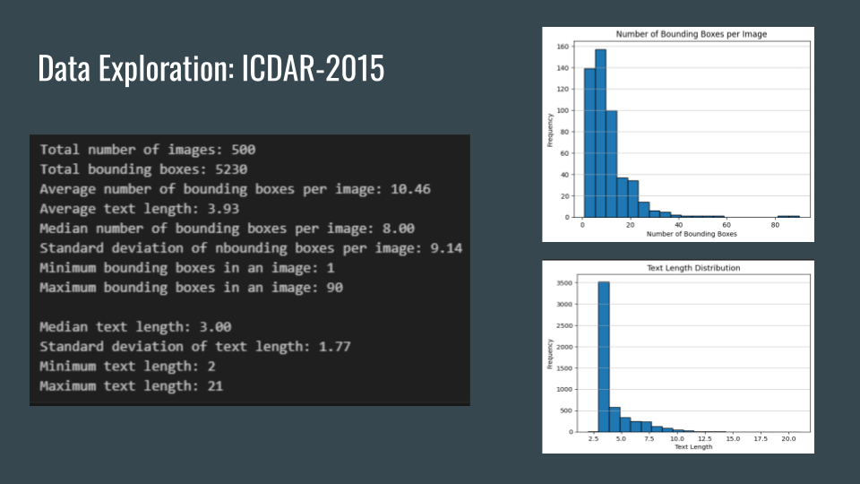
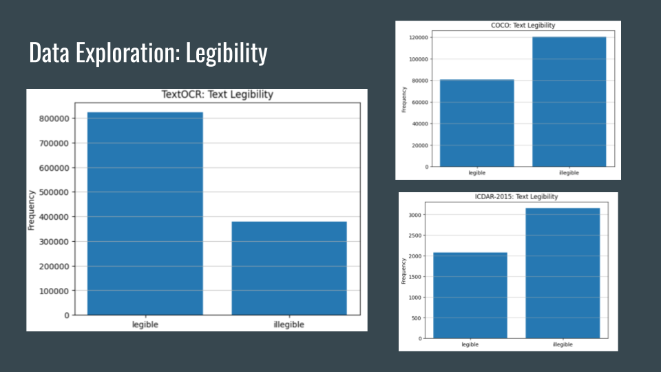
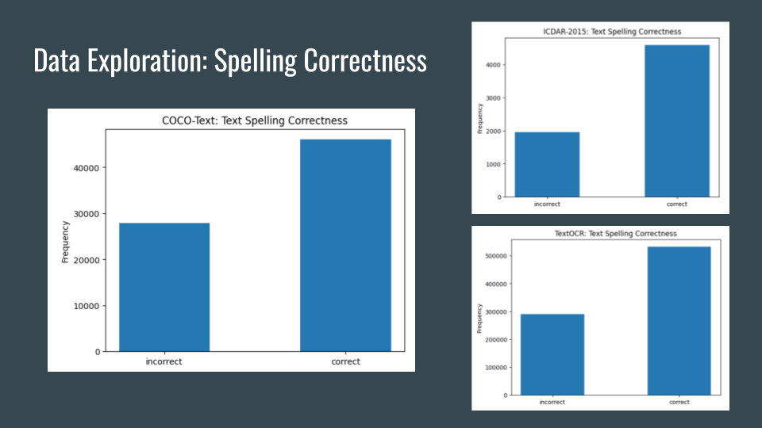

# Data mining and relationships

Most of the columns in the datasets are either independent or have too little information to make significant analysis. The only relationship we could make and thought could have a correlation in all of our datasets was between an entry’s **bounding box area** and its **legibility**.
This is because a large bounding box area means the text size is large, which should theoretically mean that the result should be more easily read by a ML model and be legible.

Using the correlation matrix function (corr()) in Pandas, we found:
* COCO-Text: correlation score of 	0.17385,		or 	17.39 %
* TextOCR: correlation score of		  0.08620, 	  or 	8.62 %
* ICDAR-2015: correlation score of	0.08289,		or 	8.29 %

In the case of ICDAR-2015, the coordinates produce an area of 0 if the text is illegible. Despite this, it still has the lowest correlation score.
Based on these findings, while there is a positive correlation between bounding box area and overall legibility (meaning larger area = more visible), it is not of a high enough percentage to make any significant conclusions about the two being tied to each other.

# Data cleaning

Columns we find to be irrelevant to this project are:
* COCO-Text: “illegibility”: if text can be identified
* COCO-Text: “class”: if text is handwritten or printed

Rows we find to be irrelevant to this project are:
* Rows where the text is unidentifiable
* Rows where the text is considered misspelled or non-English

# Dataset challenges

The biggest challenge is working with very large amounts of data:
* COCO-Text and TextOCR make up ~40 GB of data
* Working with them is very time and processor intensive

Even if data entries have recognizable text, it is not always correct:
* It may contain misspellings, cut off words, etc. which may prove to be a problem for our model’s accuracy
* It is also hard to detect such entries automatically

# Model

Previously, we were considering using a TensorFlow model with CTC (Connectionist Temporal Classification). We decided to abandon this idea for a few reasons:
* The model took far too long to feasibly train (~3 hours for 500 images) 
* The model is difficult to use, and get metrics for training and validation
* Our datasets are not suited for training, and thus produce an inaccurate model

We have instead decided to use a pretrained model, which solves these issues. Our choice was **EasyOCR**, because:
* It is a pretrained model, which solves our problems with model training
* As the name suggests, it is easy to use. Getting bounding boxes and image text only takes a few lines
* EasyOCR supports 80 input languages. This allows us to use different input languages in our translation application without needing several datasets for those languages in training

# Model metrics

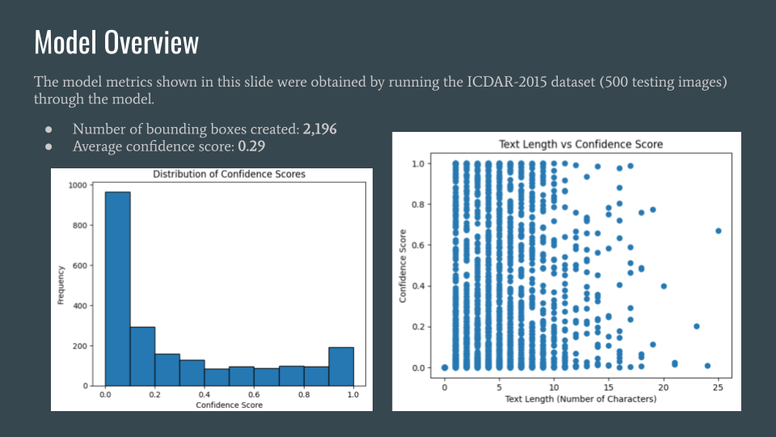
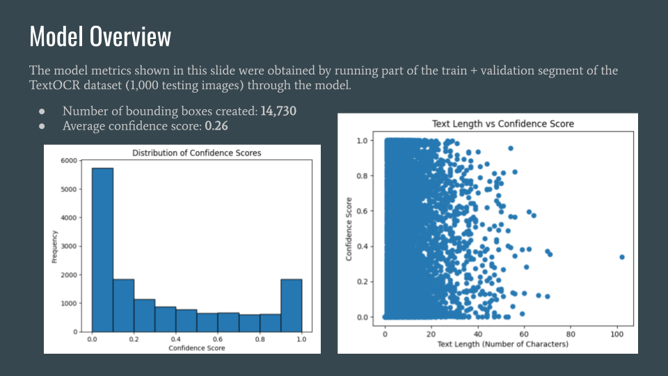

# Model evaluation

To calculate precision, recall, and F1, we used Intersection over Union (IoU) scores, comparing the predicted bounding boxes to the closest ground truth boxes (provided in the dataset). When the boxes overlap, they produce a score between 0 and 1: the closer to 1, the better the overlap and accuracy.

We used the following definitions:
* TP:	IoU > 0.5
* TN:	neither predicted box nor truth box exist (not needed or calculated)
* FP:	IoU < 0.5 
* FN:	predicted box and closest truth box do not intersect (IoU = 0)

(source: [Measuring Labelling Quality with IOU and F1 Score, Isaac Tan](https://medium.com/supahands-techblog/measuring-labelling-quality-with-iou-and-f1-score-1717e29e492f))

## Using ICDAR-2015

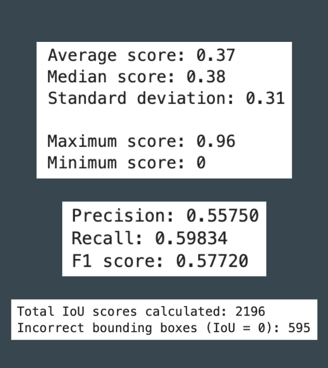

Precision is the ratio of correctly drawn annotations to the total number of drawn annotations. With every predicted bounding box, the model is about 55.75% correct in matching a truth bounding box.

Recall is the ratio of correctly drawn annotation to the total number of ground truth annotation. With every truth bounding box, the model is about 60% correct in predicting a matching bounding box.

F1 score gives us a harmonic mean between precision and recall. The score is about 57.7%.

## Using TextOCR

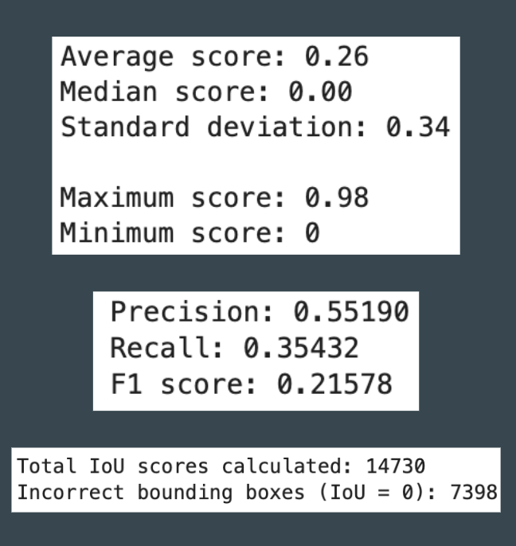

We used a larger subset for TextOCR, which itself is only a small fraction of the actual dataset. We can see that with more data, it performs much worse overall.

Precision remains about the same, but recall, and F1 score as a result, takes a very big hit.

There are a lot less matches when it comes to making bounding box predictions. While about a quarter of the predicted bounding boxes in ICDAR-2015 were incorrect, about half of the predictions are incorrect here.

# Model observations

**The very low accuracy is likely due to the high difficulty of the datasets.**

The model does not perform well with image text that is transformed (rotated, warped, blurred, etc.) or uses an unorthodox font. Most images in the datasets are like this, hence the low average confidence and IoU scores. However, many existing translation apps aren’t typically expected to work with such images, so we don’t find it to be a major problem currently.

EasyOCR does not have full support for detecting handwritten text as of now (which may explain the font issues), which may present problems when using the model in our application.

# Translation

We are considering using googletrans, which is not a Google API, but rather an unofficial Python wrapper for the Google Translate website. This allows us to use Google Translate services easily with our model without having to pay for a Google API key. It also has the ability to detect text and provide a confidence score.

(source: [pypi - googletrans](https://pypi.org/project/googletrans/))

# Frontend

We are using React for the frontend. There are 2 options on the main page: upload photo or capture a photo.

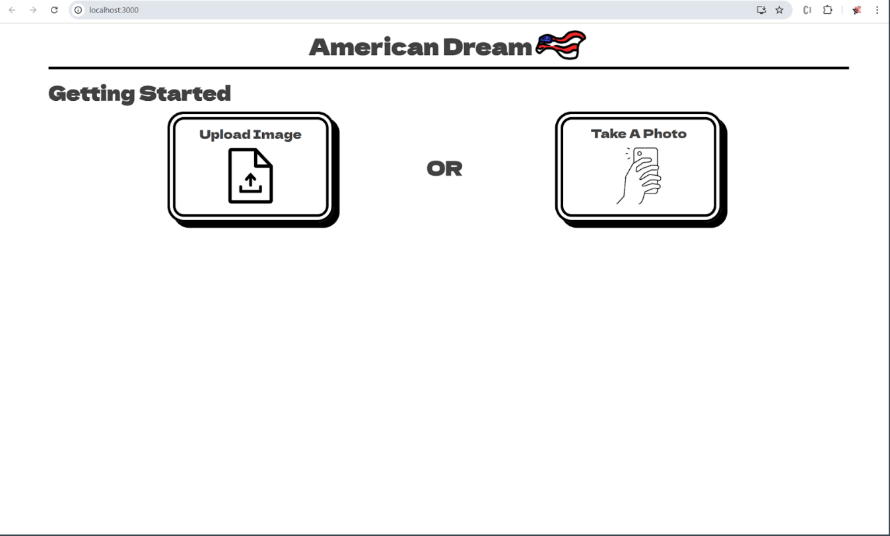

The upload image option opens up the user's file system and allows them to choose a photo. 
The ‘Take A Photo’ option, the user's webcam will open, allowing them to capture an image.

Once the image has been selected or taken, the user is automatically redirected to the /translate page. 

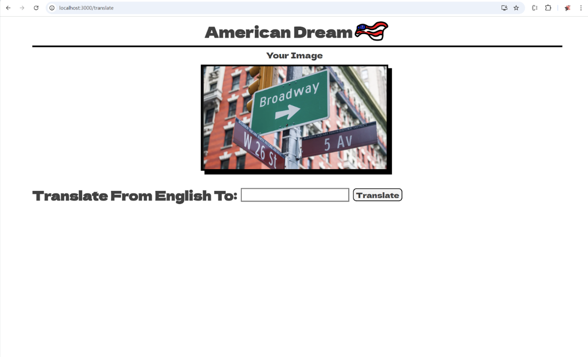

# Backend

For the backend, we decided to use Flask, as it is easy to work with and it is one that most of us have knowledge in. Additionally, we thought it will be easier to connect the model to it as they are both written in Python. 

When a user uploads or captures a photo, that photo is sent to the /upload route in our backend. The image is then saved into the /images route and returned back to the frontend, so that their photo can be shown to them.

# Next steps

Our main next steps are:
* Collect non-English image text datasets and more accuracy metrics to see the viability of EasyOCR’s multi language support
* Model accuracy tests using our other (clearer!) datasets, including TextOCR
* Integrate the model and API with our web application
* User account system for application to view and favorite past translations
  
We are interested in also creating a mobile application using react-native. 

